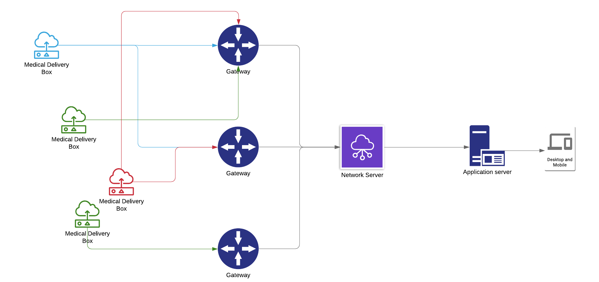
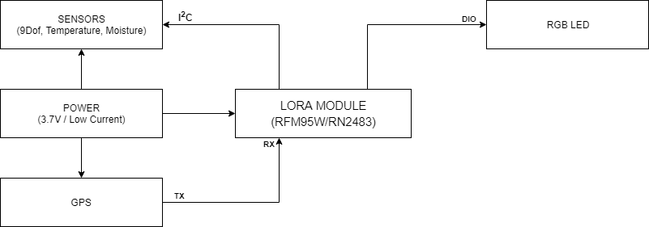
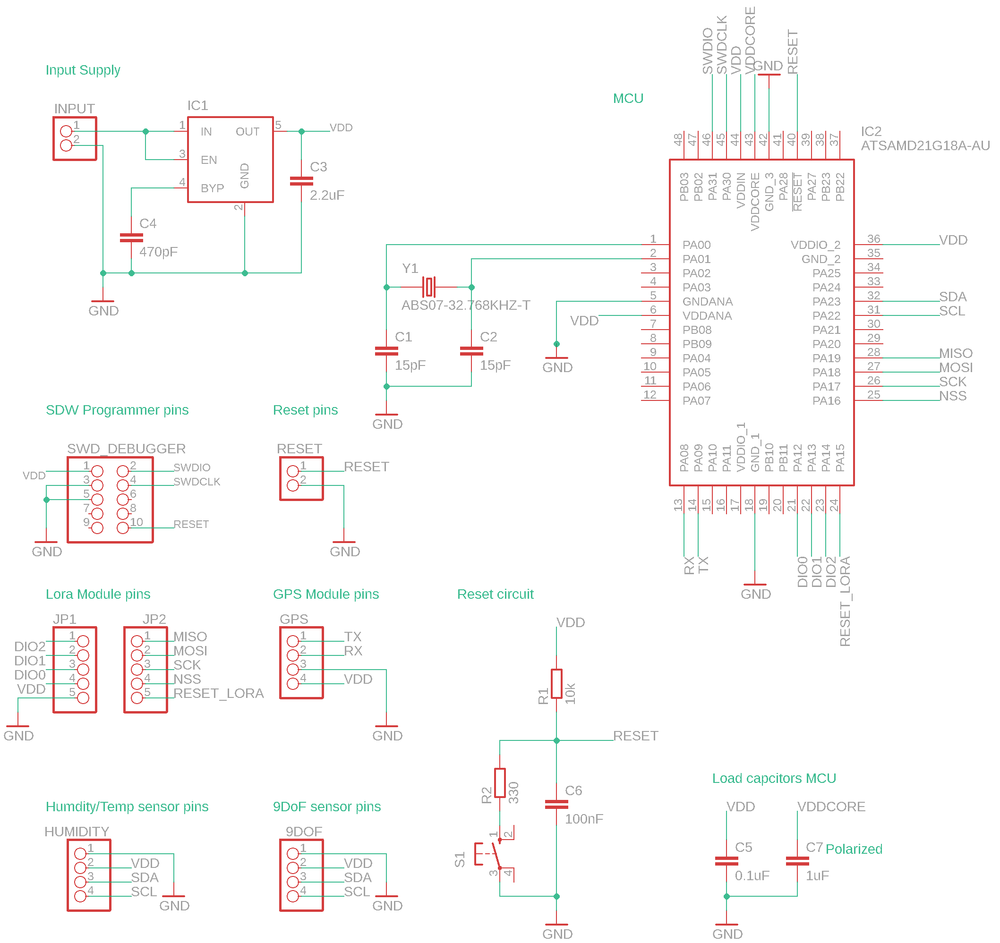
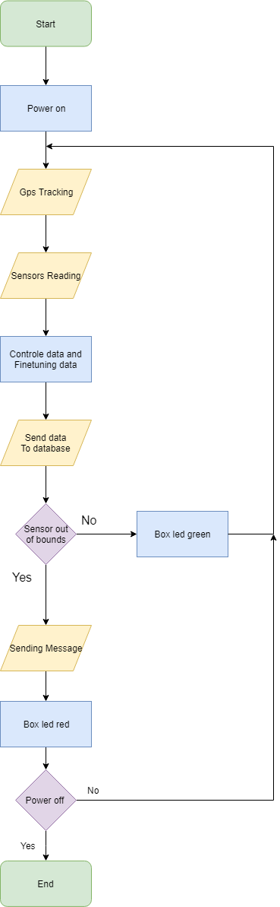
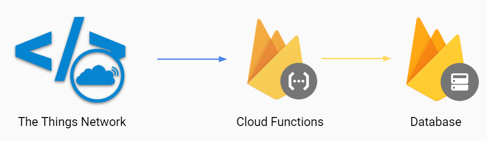
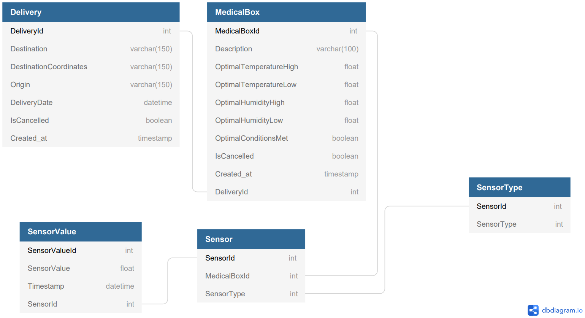
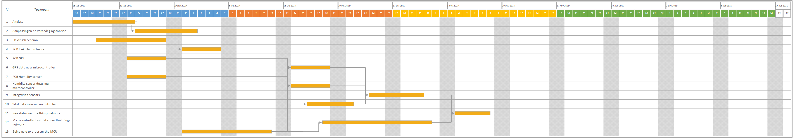

# Analyse

## Onderzoeksvraag

> Zijn producten nog bruikbaar na het transport door verschillende omstandigheden?  
> Hoe kunnen leveranciers weten dat ze tijdens transport moeten ingrijpen?  
> Wat moet er gebeuren indien producten onbruikbaar zijn geworden tijdens het transport?

## Voorstel tot oplossing

Medical delivery is een probleem in moeilijk bereikbare delen van de wereld. Er zijn veel omgevingen met schommelende temperaturen, van onder het nulpunt tot de brandende zon. Schokken tijdens het vervoeren van medische goederen kan de chemische structuur van de medicijnen aanpassen of andere pakketten onbruikbaar maken. Hierdoor bestaat er ook onzekerheid over herlevering.
Er is geen real-time informatie over de afstand en de staat van het product.

### Overzicht oplossing

Via real-time data kan men de locatie en de staat van het product nakijken. Een cross platform webapplicatie zal dit mogelijk maken. Indien een gebruiker het nodig acht om andere producten te laten brengen door een andere leverancier is dit mogelijk via de webapplicatie. De gebruiker zou de reeds bestelde producten kunnen annuleren indien deze niet meer aan de voorwaarden voldoen. Dan kan de transporteur terug gaan voor een nieuwe lading.

De mogelijkheid moet er ook zijn om alle producten onderweg op een kaart te zien, of de dozen in gebruik zijn en of deze aan het opladen zijn en waar deze gestockeerd staan. De hoeveelheid batterij resterend weergeven als je deze informatie opvraagt.

Per doos moeten er ook bepaalde specificaties ingesteld kunnen worden; bv. Hoeveel schokken kan deze doos aan, de maximum en minimum temperatuur, etc.

De leverancier moet producten kunnen kiezen welke hij meeneemt. Wanneer de leverancier een van de voorwaarden dreigt te overschrijden dient de webapplicatie op de smartphone/tablet een melding te geven zodat men hier tijdig op kan anticiperen.

#### Algemene architectuur

De verschillende boxen zullen als nodes werken en samen in een transportmiddel gestoken worden. Deze boxen sturen na een ingestelde tijdspanne data door indien er over de ingestelde grenzen is gegaan. De data wordt verstuurd naar LoRa Gateways. De sensor data die worden vergaard zijn oriëntatie, schokken, temperatuur, vochtigheid en positie. Aangezien het over afgelegen gebieden zou kunnen gaan waar geen LoRa gateway verbinding aanwezig zou zijn, kan er gebruikt gemaakt worden van een versterker zodat de reikwijdte vergroot wordt. De data zal gefilterd moeten worden via de end nodes zelf en enkel nodige data doorsturen.

## Marktonderzoek

|                        | Medicalcouriers                             | Hydropac                                | Worldcourier                                                                                | Actioncourier                        | Zipline                                                                      | TNT Healtcare section Supplies                                                                                                                                                                                       |
| ---------------------- | ------------------------------------------- | --------------------------------------- | ------------------------------------------------------------------------------------------- | ------------------------------------ | ---------------------------------------------------------------------------- | -------------------------------------------------------------------------------------------------------------------------------------------------------------------------------------------------------------------- |
| Sensors                | ?                                           | ?                                       | Ambient temperature, internal temperature, light, tilt, pressureand physical shock sensors. | ?                                    | ?                                                                            | Ambient temperature and internal temperature sensors                                                                                                                                                                 |
| Tracking               | Tracking APP, Tracking center               | /                                       | GPS (Customer Resource Center (CRC) )                                                       | Digital Log Tracking, GPS            | 3D sattelite map and manual ground surveys                                   | GPS                                                                                                                                                                                                                  |
| Temperature control    | /                                           | Can choose min and max of temperature   | controls ambient an internal temperature                                                    | /                                    | /                                                                            | Realtime tracking of temprature                                                                                                                                                                                      |
| Communication protocol | /                                           | /                                       | BLE, GSM                                                                                    | /                                    | SMS                                                                          | /                                                                                                                                                                                                                    |
| App Control            | Realtimedata, Dashboard                     | /                                       | Realtime, monitoring                                                                        | Monitoring                           | On-demand through a simple app, when they need it, monitoring, realtime data | Realtimedata, Monitoring                                                                                                                                                                                             |
| Transit time           | /                                           | Adjustable                              | /                                                                                           | Non-stop delivery                    | 30 - 45 min delivery                                                         | Sameday Delivery (ophaling en levering via de weg, na ophaling rechtstreekse levering bij de opgegeven ontvanger), Onboard courier ( zendingen die persoonlijke aandacht eisen), Air charter ( dringende zendingen ) |
| Type                   | Medical Courier                             | Insulated Shipping Systems              | Medical logistics                                                                           | Medical Courier serivce              | Blood delivery by drone                                                      | Transport                                                                                                                                                                                                            |
| Leveringen in          |     Washington, Oregon, Montana, Idaho, Wyoming, Californiä, Nevada, Utah, Arizona, New Mexico, Colorado, Oklahoma, Texas, Louisiana, Mississippi, Georgia, Alabama, Florida, North Carolina, Iowa, Minnesota, Wisconsin, Illinois, Michigan, Kentucky, Ohio, Indiana, Pennsylvania                                        |  UK                                       |      Europa, North America, Asia PAcific, Latin America, Middle East, Africa                                                                                       |Oklahoma, Texas, Louisiana, Mississippi, Georgia, Alabama, Florida, North/South Carolina, Iowa, Minnesota, Wisconsin, Illinois, Michigan, Kentucky, Ohio, Indiana, Pennsylvania, Arkansas, Tennessee, Missouri, Virginia-West Virginia, Maryland, Delaware, New Jersey, New York, Connecticut, Massachusetts, Rhode Island, Maine, New Hampshire, Vermont                                      |            Rwanda & Ghana                                                                  |Europe, Asia, Middle East, US|
| Website                | [Website](https://www.medicalcouriers.com/) | [Website](https://hydropac.co.uk/#medi) | [Website](https://www.worldcourier.com/)                                                    | [Website](https://actioncourier.com) | [Website](https://flyzipline.com/)                                           | [Website](https://common.tnt.com/express/en_xx/site/home/services/industry_sol/healthcare/pharmasafe.html)                                                                                                           |

## Detail analyse

#### Blokdiagram

##### Specificatietabel

| Blok                     | Specificatie                      | Min   | Nominaal   | Max   |
| ------------------------ | --------------------------------- | ----- | ---------- | ----- |
| Atmel SAM D21            | Werkspanning                      | 1.62V |            | 3.63V |
|                          | Low-power verbruik                |       | <70 µA/MHz |       |
| RFM95W                   | Werkspanning                      | 1.8V  |            | 3.7V  |
| Lithium batterij         | Spanning                          |       | 3.7V       |       |
|                          | Capaciteit                        |       | 2000mAh    |       |
| Telit SL876Q5-A GPS      | Werkspanning                      | 1.71V |            | 1.89V |
|                          | Stroomverbruik signal acquisition |       | 85mW       |       |
|                          | Stroomverbruik tracking           |       | 83mW       |       |
|                          | Horizontale positie nauwkeurigheid|       | 1.5m       |       |
|                          | Snelheid nauwkeurigheid           |       | 0.01 m/s   |       |
|                          | Richting nauwkeurigheid           |       | 0.01 deg   |       |
| HIH8120-021-001 TEMP HUM | Werkspanning                      | 2.3V  | 3.3        | 5.5V  |
|                          | Temperatuur range                 | -40°C |            | 125°C |
|                          | Temperatuur nauwkeurigheid        |       | ±0.8       |       |
|                          | Humidity range                    | 0RH   |            | 100RH |
|                          | Humidity nauwkeurigheid           |       | ±2.0 %RH    |       |
|                          | Sleep current                     |       | 0.6µA      | 1µA   |
|                          | Supply current (I²C)              |       | 0.65mA     | 1mA   |
| IMU 9DOF v2.0            | Werkspanning                      | 2.4V  |            | 3.6V  |
| MIC5219-3.3YM5-TR            | Werkspanning                      | 2.5V  |            | 12V  |
|                          | Uitgangspanning                   |       | 3.3V       |       |
|                          | Stroomverbruik                    | 0     |            | 500mA |
|                          | Temperatuur range                 | -40°C |            | 125°C |
| Q13MC30610003 MC-306     | Frequency range                   | 20kHz | 32.768kHz  | 165kHz |
|                          | Laad Capaciteit                   |       | 12.5pF     |       |
|                          |                                   |       |            |       |

##### Argumentatietabel

| Blok              | Argumentatie                                                                                                                                                                                                                                                                                                                   | Alternatieven     |
| ----------------- | ------------------------------------------------------------------------------------------------------------------------------------------------------------------------------------------------------------------------------------------------------------------------------------------------------------------------------ | ----------------- |
| Microcontroller   | Atmel SAM D21G gekozen omdat deze low power is. Heeft tot 6 Serial Communication Modules (SERCOM) dat elk geconfigureerd kunnen worden als een USART, UART, SPI of I²C.                                                                                                                                                        | ATmega328p        |
| GPS               | Er wordt gebruik gemaakt van de Telit SL876Q5-A GPS module van Telit deze module gebruikt relatief weinig vermogen (83mW - 85mW) en heeft verschillende modi die energie kunnen besparen. Ook heeft hij een hogere update rate van 10 Hz. Deze module ondersteund zowel GPS als GLONASS waardoor er meer satellieten zijn voor een nauwkeurige positie.    | NEO-6M, BN-280    |
| LoRa module       | RFM95W werd gekozen omdat deze aanzienlijk minder stroom verbruikt dan concurrerende modules. De hoge sensitiviteit met de +20dBm eindversterker levert een industry leading link budget op, waardoor het optimaal is voor elke toepassing die bereik of robuustheid vereist.                                                  | RN2483            |
| Temperatuur / Humidity sensor | De Honeywell 2-in-1 temperatuur- en vochtigheidssensor is nauwkeurig tot 0.8°C, 2.0 %RH en heeft een temperatuur range van -40°C tot 125°C. Door deze sensor te gebruiken wordt er pcb oppervlakte bespaart. De I2C output zorgt voor een makkelijkere integratie met de microcontroller.                                                      |  LMT87, LM35, MCP9700     |
| IMU 9DOF v2.0     | Ultra-low power, low voltage. Heeft een wide detecting range.                                                                                                                                                                                                                                                                  | 9DoF Sensor Stick |

#### Elektrisch schema

[Elektrisch Schema](./electrical_scheme.md)
#### State Diagram

#### Flowchart

### Front End

### Back End

Er wordt gebruik gemaakt van firebase als "back end" dit omdat het makkelijk is om te scalen. De realtime database is ook een troef van Firebase waardoor de data in real-time wordt verstuurd naar de app of webapp wat aangenamer is voor de eindgbruiker.

#### Database Model

## Niet functionele analyse

## Release plan

## Inventarisatie Hardware

- Atmel SAM D21E - Microcontroller
- RFM95W - LoRa Module
- Telit SL876Q5-A - GPS Module
- HIH8120-021-001 - Temperature/Humidity sensor
- IMU 9DOF v2.0 - 9DoF
- MIC5219-3.3YM5-TR - Voltage regulator
- Lithium battery

[Bill of materials](./Bill_of_materials.pdf)

## Inventarisatie software

- AtmelStudio
- Angular
- Firebase
