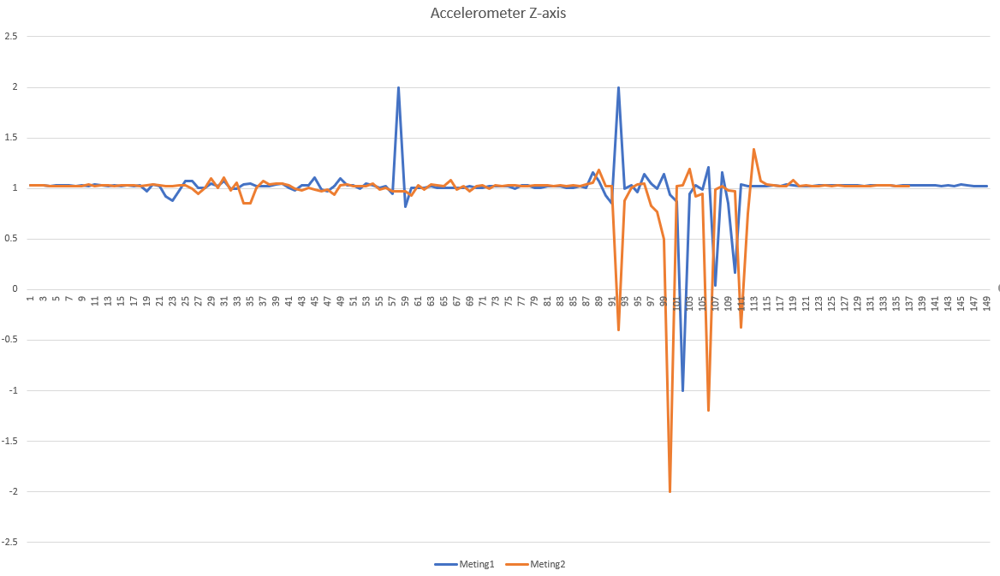

# LoRa The Things Network Code Documentation

## Getting started

The 9DoF stick is connected via I2C to the microcontroller.

To install this library:

- Install it using the Arduino Library manager ("Sketch" -> "Include Library" -> "Manage Libraries...")
- download a zipfile from github using the "Download ZIP" button and install it using the IDE ("Sketch" -> "Include Library" -> "Add .ZIP Library..."
- clone the git repository into your sketchbook/libraries folder

  [Download Link LSM9DS1 Library](https://github.com/sparkfun/SparkFun_LSM9DS1_Arduino_Library/archive/master.zip)

## Sketch

In __LSM9DS1_Basic_I2C.ino__ you can see an example setup of some code that prints the 9DoF stick data.

As an example ```imu.calcAccel(imu.az)``` this shows the amount of force when moving up or down. This gives a digit back in the sketch they refer to it as G. In the graph you can see that we there were somet tests done. The peaks going up over 1.5 are forces going upwards (9DoF stick moving upwards). The others peaks going down under 0.5 are forces going downwards (9DoF stick moving downwards). In resting position the G-force is around 1 (G-force from the earth around 9.8m/s^2).



## Integration LoRaWAN & 9DoF

For the integrations there were chosen some set boundaries. We send every out of boundaries a payload over the LoRa network. The payload was the highest/lowest value of the peak.