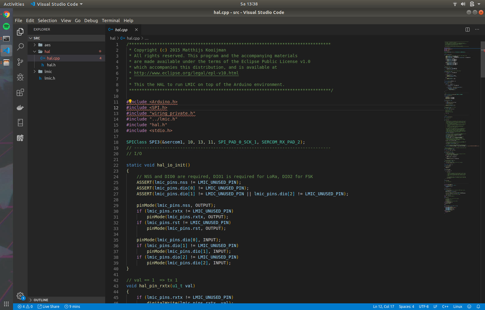
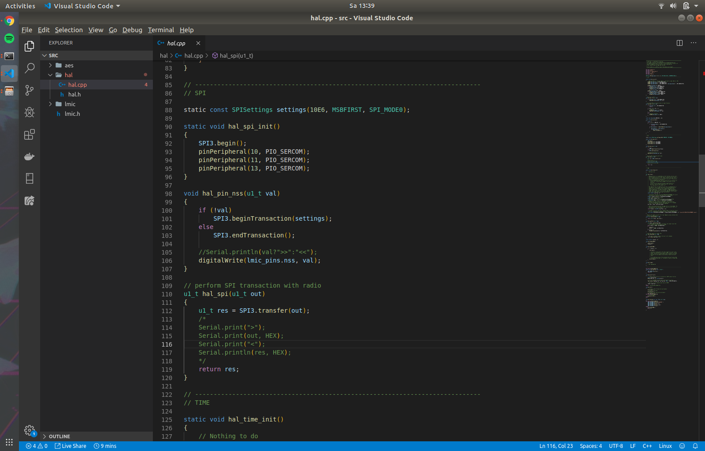

# LoRa the things network
## LoRa RFM95W library

In dit project is er gebruik gemaakt van de arduino-lmic [library](https://github.com/matthijskooijman/arduino-lmic).

Echter omdat er gewerkt werd met een SAMD21 en de legacy SPI pins niet gekozen werden was het noodzakelijk om een SPIClass in te stellen voor deze poorten. Dit werd in de library zelf aangepast.

Aangepaste library: [LMIC - SERCOM](./arduino-lmic-aangepast.zip).

```
SPIClass SPI3(&sercom1, 10, 13, 11, SPI_PAD_0_SCK_1, SERCOM_RX_PAD_2);
```

```
    // Dit stuk code zou in een nieuwe methode kunnen gebeuren, dit is in de hal_spi_init() methode in de library geplaatst. 
    pinPeripheral(10, PIO_SERCOM);
    pinPeripheral(11, PIO_SERCOM);
    pinPeripheral(13, PIO_SERCOM);
```


Eensgelijks moest de juiste SPIClass aangeroepen worden dus in plaats van *"SPI.begin()"* werd dit vervangen door *"SPI3.begin()"*.


