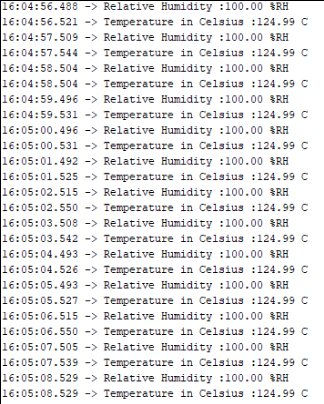
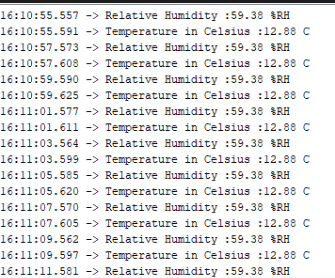
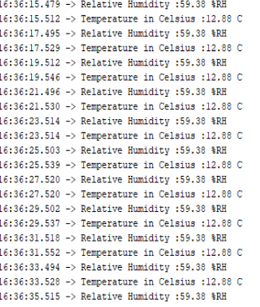

# Testrapport - Humidity Sensor HIH6030 SMD 8 pins

#### Datum: 06-12-2019
#### Code versie: Eerste code met gewoon Wire library
#### Test done by: Cristian Baba

## Test sensor 1

- [OK] Test wire connections
    - [ok] VDD
    - [ok] GND
    - [ok] Specific sensor pins
- [NOK] Log data on micrcontroller  
    - [OK] Every 2 secondes
    - [NOK] Data should be printed as: NameSensor: xx.xx unit.
    - [OK] Add screenshot of timestamp and data

Bevindingen: Incorrecte data humidity is 100%.

## Test sensor 2

- [OK] Test wire connections
    - [OK] VDD
    - [OK] GND
    - [OK] Specific sensor pins
- [OK] Log data on micrcontroller  
    - [OK] Every 2 secondes
    - [OK] Data should be printed as: NameSensor: xx.xx unit.
    - [OK] Add screenshot of timestamp and data

Bevindingen: Te koude temperatuur, humidity zou kunnen kloppen.

## Test sensor 3

- [OK] Test wire connections
    - [OK] VDD
    - [OK] GND
    - [OK] Specific sensor pins
- [OK] Log data on micrcontroller  
    - [OK] Every 2 secondes
    - [OK] Data should be printed as: NameSensor: xx.xx unit.
    - [OK] Add screenshot of timestamp and data

## Test sensor 4

- [OK] Test wire connections
    - [OK] VDD
    - [OK] GND
    - [OK] Specific sensor pins
- [OK] Log data on micrcontroller  
    - [OK] Every 2 secondes
    - [OK] Data should be printed as: NameSensor: xx.xx unit.
    - [OK] Add screenshot of timestamp and data

## Test sensor 5

- [OK] Test wire connections
    - [OK] VDD
    - [OK] GND
    - [OK] Specific sensor pins
- [OK] Log data on micrcontroller  
    - [OK] Every 2 secondes
    - [OK] Data should be printed as: NameSensor: xx.xx unit.
    - [OK] Add screenshot of timestamp and data

## Besluit
Alle aansluitingen lijken te testen, 1ste sensor gaf een humidity van 100%. Deze lijkt een misfunction te hebben, op de achterkant aangeduid met een blauwe 1. Nieuwe code schrijven en alle sensoren opnieuw testen.