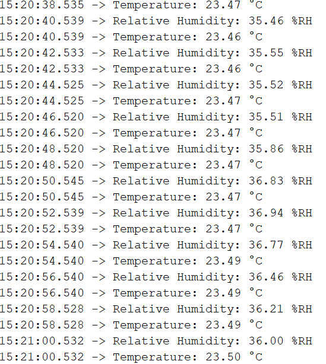
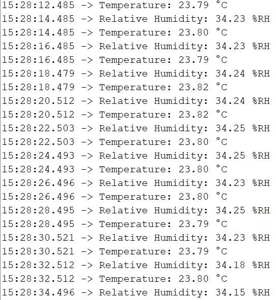
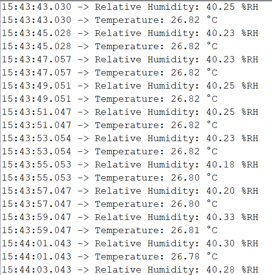
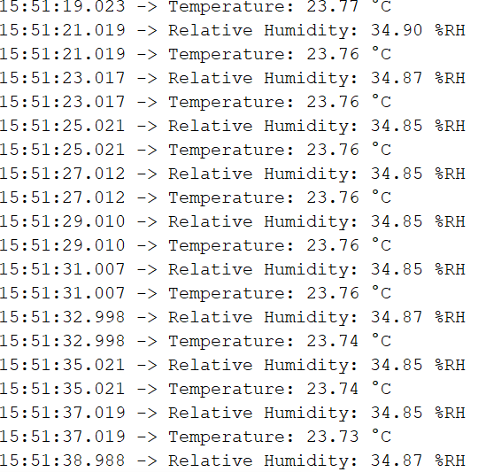

# Testrapport - Humidity Sensor HIH6030 SMD 8 pins

#### Datum: 07-12-2019
#### Code versie: Library van HIH61xx geimport en getest met de example sketch
#### Test done by: Oussama Es-Salhi
#### Tested with Microcontroller: Arduino NANO

## Test sensor 1

- [OK] Test wire connections
    - [OK] VDD
    - [OK] GND
    - [OK] Specific sensor pins
- [OK] Log data on micrcontroller  
    - [OK] Every 2 secondes
    - [OK] Data should be printed as: NameSensor: xx.xx unit.
    - [OK] Add screenshot of timestamp and data

## Test sensor 2

- [OK] Test wire connections
    - [OK] VDD
    - [OK] GND
    - [OK] Specific sensor pins
- [OK] Log data on micrcontroller  
    - [OK] Every 2 secondes
    - [OK] Data should be printed as: NameSensor: xx.xx unit.
    - [OK] Add screenshot of timestamp and data

## Test sensor 3

- [OK] Test wire connections
    - [OK] VDD
    - [OK] GND
    - [OK] Specific sensor pins
- [OK] Log data on micrcontroller  
    - [OK] Every 2 secondes
    - [OK] Data should be printed as: NameSensor: xx.xx unit.
    - [OK] Add screenshot of timestamp and data

## Test sensor 4

- [OK] Test wire connections
    - [OK] VDD
    - [OK] GND
    - [OK] Specific sensor pins
- [OK] Log data on micrcontroller  
    - [OK] Every 2 secondes
    - [OK] Data should be printed as: NameSensor: xx.xx unit.
    - [OK] Add screenshot of timestamp and data

## Test sensor 5

- [OK] Test wire connections
    - [OK] VDD
    - [OK] GND
    - [OK] Specific sensor pins
- [OK] Log data on micrcontroller  
    - [OK] Every 2 secondes
    - [OK] Data should be printed as: NameSensor: xx.xx unit.
    - [OK] Add screenshot of timestamp and data

## Besluit
Na de nieuwe code erop te hebben gezet krijgen we waarden die juist zouden kunnen zijn, nog nakijken met ander meetinstrument bv. temperatuur sensor om te kijken of de sensoren kloppen.
Sensor 2 heeft een temperatuur die 2 graden celcius hoger ligt dan de anderen.
